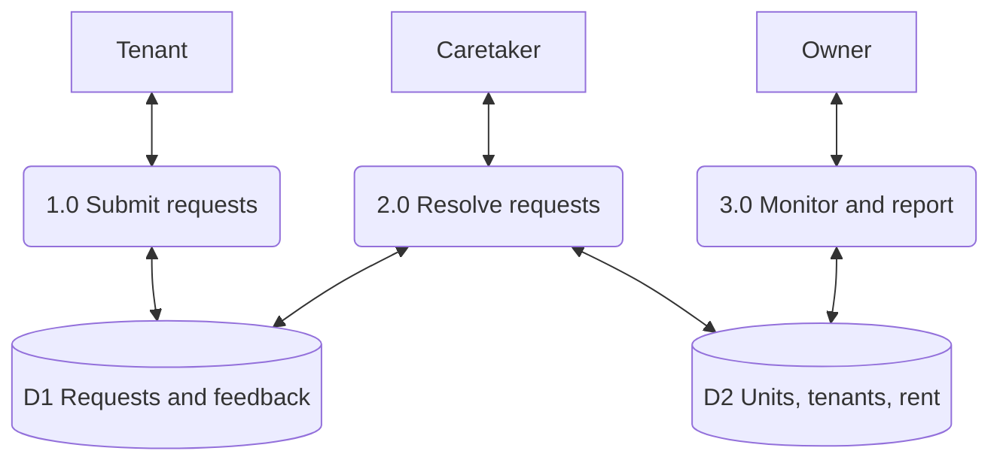
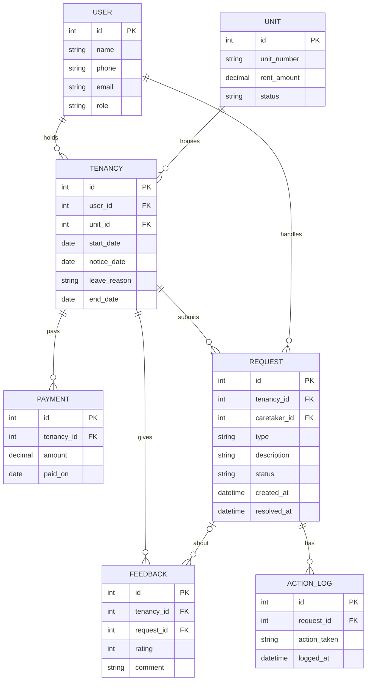
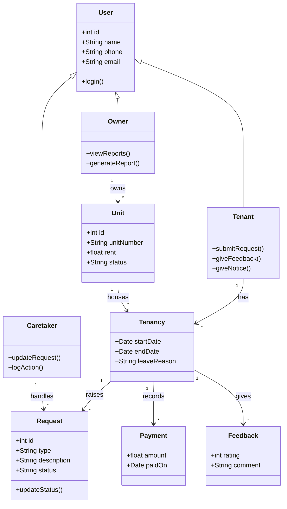
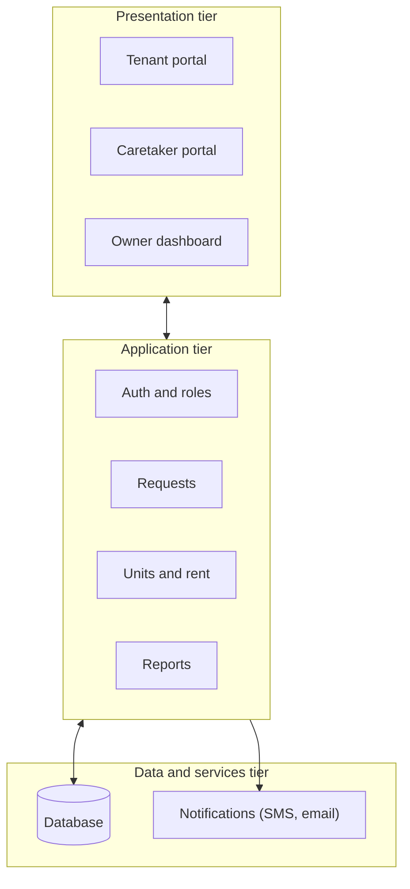

# Property Management System: Diagrams

## 1. Data flow diagram (Level 1)

```mermaid
flowchart TB
  T["Tenant"]
  C["Caretaker"]
  O["Owner"]
  P1("1.0 Submit requests")
  P2("2.0 Resolve requests")
  P3("3.0 Monitor and report")
  D1[("D1 Requests and feedback")]
  D2[("D2 Units, tenants, rent")]

  T <--> P1
  C <--> P2
  O <--> P3
  P1 <--> D1
  P2 <--> D1
  P2 <--> D2
  P3 <--> D2
```

## 2. Entity relationship diagram

```mermaid
erDiagram
  USER ||--o{ TENANCY : holds
  UNIT ||--o{ TENANCY : houses
  TENANCY ||--o{ PAYMENT : pays
  TENANCY ||--o{ REQUEST : submits
  USER ||--o{ REQUEST : handles
  REQUEST ||--o{ ACTION_LOG : has
  TENANCY ||--o{ FEEDBACK : gives
  REQUEST |o--o{ FEEDBACK : about

  USER {
    int id PK
    string name
    string phone
    string email
    string role
  }
  UNIT {
    int id PK
    string unit_number
    decimal rent_amount
    string status
  }
  TENANCY {
    int id PK
    int user_id FK
    int unit_id FK
    date start_date
    date notice_date
    string leave_reason
    date end_date
  }
  PAYMENT {
    int id PK
    int tenancy_id FK
    decimal amount
    date paid_on
  }
  REQUEST {
    int id PK
    int tenancy_id FK
    int caretaker_id FK
    string type
    string description
    string status
    datetime created_at
    datetime resolved_at
  }
  ACTION_LOG {
    int id PK
    int request_id FK
    string action_taken
    datetime logged_at
  }
  FEEDBACK {
    int id PK
    int tenancy_id FK
    int request_id FK
    int rating
    string comment
  }
```

## 3. Class diagram

```mermaid
classDiagram
  class User {
    +int id
    +String name
    +String phone
    +String email
    +login()
  }
  class Owner {
    +viewReports()
    +generateReport()
  }
  class Caretaker {
    +updateRequest()
    +logAction()
  }
  class Tenant {
    +submitRequest()
    +giveFeedback()
    +giveNotice()
  }
  class Unit {
    +int id
    +String unitNumber
    +float rent
    +String status
  }
  class Tenancy {
    +Date startDate
    +Date endDate
    +String leaveReason
  }
  class Request {
    +int id
    +String type
    +String description
    +String status
    +updateStatus()
  }
  class Payment {
    +float amount
    +Date paidOn
  }
  class Feedback {
    +int rating
    +String comment
  }
  User <|-- Owner
  User <|-- Caretaker
  User <|-- Tenant
  Owner "1" --> "*" Unit : owns
  Tenant "1" --> "*" Tenancy : has
  Unit "1" --> "*" Tenancy : houses
  Tenancy "1" --> "*" Payment : records
  Tenancy "1" --> "*" Request : raises
  Caretaker "1" --> "*" Request : handles
  Tenancy "1" --> "*" Feedback : gives
```

## 4. System architecture

```mermaid
flowchart TB
  subgraph PT["Presentation tier"]
    TP["Tenant portal"]
    CP["Caretaker portal"]
    OD["Owner dashboard"]
  end
  subgraph AT["Application tier"]
    AU["Auth and roles"]
    RQ["Requests"]
    UR["Units and rent"]
    RP["Reports"]
  end
  subgraph DT["Data and services tier"]
    DB[("Database")]
    NT["Notifications (SMS, email)"]
  end

  PT <--> AT
  AT <--> DB
  AT --> NT
```
